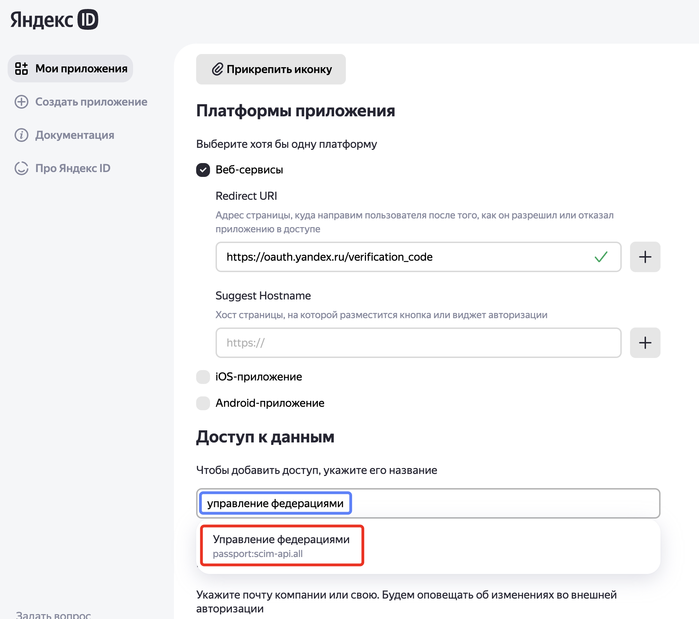
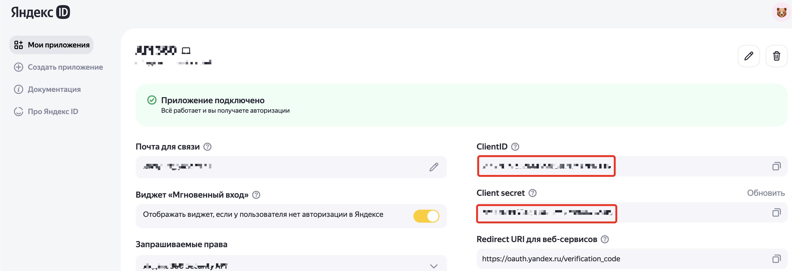
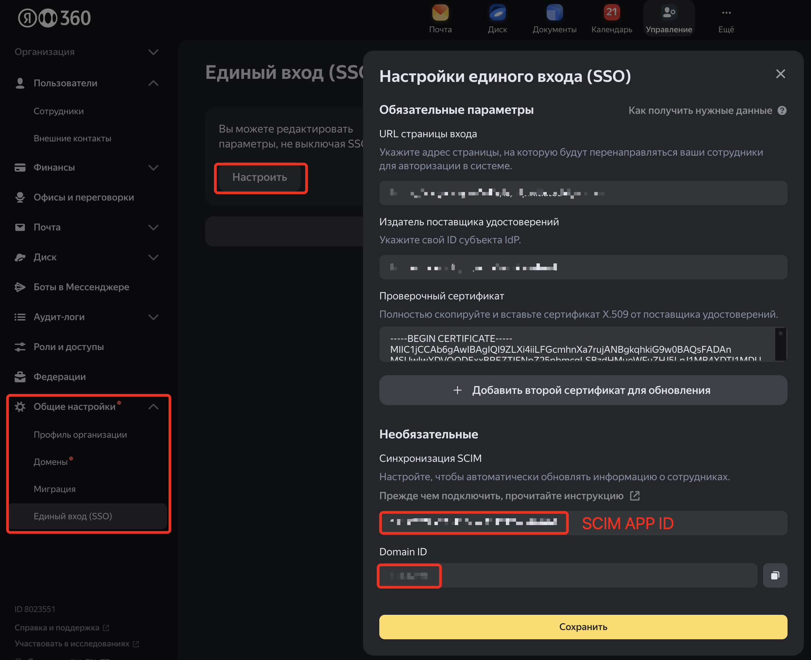
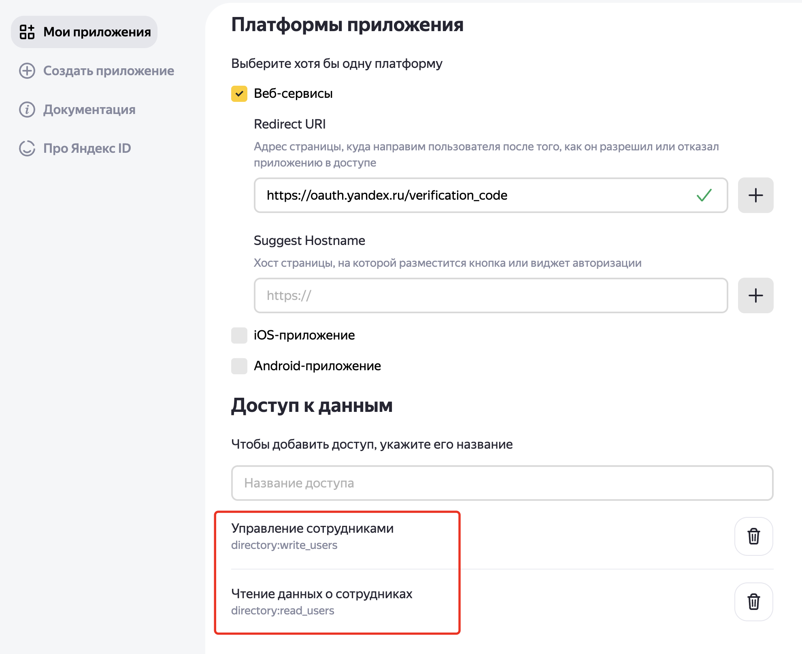

# Изменение атрибутов userName и nickname пользователя в Яндекс 360 через API

## Обзор

Скрипт `change_username.py` предназначен для управления атрибутами пользователей в Yandex 360, включая `userName` (через SCIM API) и `nickname` (через Yandex 360 API). Он позволяет:
- Загружать данные пользователей для массового редактирования атрибута userName и использовать этот файл как входные данные для работы процедуры переименования.
- Формировать новые значения `userName` в файле на основе шаблона.
- Обновлять атрибуты `userName` или `nickname` для пользователей.
- Проверять псевдонимы (aliases) в атрибутах всех пользователей организации Яндекс 360 и отображать/сохранять детализированные данные об атрибутах пользователя в каталоге Яндекс 360.
- Работать в интерактивном режиме или через командную строку с позиционными аргументами.

## Сценарии использования
Скрипт позволяет модифицировать через соответствующее API (SCIM для `userName` или API 360 для `nickname`) атрибуты пользователя, которые невозможно модифицировать через GUI.
Необходимость модификации этих атрибутов возникает в следующих случаях:
- У пользователя в Active Directory поменялось значение атрибута, используемого в SCIM утилите как `PropertyLoginName` (по умолчению это `userPrincipalName`) и который выступает как `NameId` claim в SAMLResponse ответе SAML провайдера при аутентификации пользователя организации в Яндекс 360. В таком сценарии учётная запись пользователя будет заблокирована в Яндекс 360 и для её разблокировки и логина пользователя через локального SAML провайдера необходимо менять `userName` в SCIM протоколе.
- У пользователя поменялся основной email адрес, передаваемый в SCIM утилите как `PropertyWorkMail` (по умолчанию это атрибут `mail` в Active Directory). Алиас этого атрибута используется для формирования в каталоге Яндекс 360 атрибута `nickname`, который в дальнейшем участвует в формировании основного алиаса и адреса электронной почты в виде вычисляемого атрибута email (nickname@<основной_домен>) в организации Яндекс 360. Атрибут заполняется при создании пользователя и в дальнейшем не модифицируется утилитой SCIM или через консоль адимнистрирования Яндекс 360.

> [!NOTE]
> Более подробное описание деталей, свяанных с модификацией атрибута userName смотрите в [статье на Хабре](https://habr.com/ru/companies/yandex360/articles/795483/) (раздел "Переименование пользователя в Active Directory").

> [!WARNING]
> Перед модификацией атрибутов пользователя с помощью этой утилиты настоятельно рекомендуется остановить службу синхронизации "Yandex AD SCIM". После выполнения работ службу необходимо включить и проверить правильность проведённых изменений. 

## Логика работы

1. **Загрузка настроек**:
   - Читает параметры из файла `.env`: токены (`SCIM_TOKEN_ARG`, `OAUTH_TOKEN_ARG`), идентификаторы (`SCIM_DOMAIN_ID_ARG`, `ORG_ID_ARG`), имя CSV-файла (`USERS_FILE_ARG`), шаблон имени пользователя (`NEW_LOGIN_DEFAULT_FORMAT_ARG`).
   - Проверяет наличие обязательных параметров и валидность токенов.

2. **Режимы работы**:
   - **Командная строка**: Принимает позиционные аргументы (`old new attribute [confirm]`), где:
     - `old` — текущее значение (`userName` или `nickname`).
     - `new` — новое значение.
     - `attribute` — изменяемый атрибут (`userName` или `nickname`).
     - `confirm` — подтверждение (`yes` или `no`).
     - Если аргументов меньше трёх, запускается интерактивное меню.
   - **Интерактивное меню**:
     - **1**: Установить шаблон формирования нового `userName` (по умолчанию `alias@domain.tld`).
     - **2**: Проверить существование псевдонима в Yandex 360.
     - **3**: Сохранить данные пользователя (по ID, `userName`, `nickname` или псевдониму) в текстовый файл.
     - **4**: Загрузить данные пользователей из SCIM API в CSV-файл.
     - **5**: Обновить `userName` на основе CSV-файла.
     - **6**: Изменить `userName` для одного пользователя (ввод вручную).
     - **7**: Изменить `nickname` для одного пользователя.
     - **8**: Выгрузить всех пользователей в файлы (отдельно для SCIM и отдельно для API 360 протокола).
     - **0**: Выход.

3. **Загрузка пользователей (Опция 4)**:
   - Выполняет GET-запросы к SCIM API (`/v2/Users`) для получения списка пользователей с пагинацией (100 записей за запрос).
   - Формирует новые значения `userName` по шаблону `NEW_LOGIN_DEFAULT_FORMAT_ARG`.
   - Сохраняет данные в CSV-файл с полями: `uid`, `displayName`, `old_userName`, `new_userName`.

4. **Обновление пользователей (Опция 5 или командная строка с `userName`)**:
   - Читает CSV-файл, пропуская строки с некорректным `uid`, пустым `new_userName` или совпадающим `old_userName` и `new_userName`.
   - Для командной строки: проверяет существование `old` и уникальность `new` в SCIM API.
   - Запрашивает подтверждение (если `confirm=no` или отсутствует).
   - Выполняет PATCH-запросы к SCIM API для обновления `userName` с тремя попытками (задержка 2 секунды).

5. **Изменение псевдонима (Опция 7 или командная строка с `nickname`)**:
   - Проверяет существование `old` и уникальность `new` в Yandex 360 API (учитывает `nickname`, псевдонимы, email-контакты).
   - Удаляет конфликтующие псевдонимы или email-контакты через SCIM API.
   - Выполняет PATCH-запрос к Yandex 360 API для обновления `nickname`.

6. **Проверка псевдонимов (Опция 2)**:
   - Проверяет, используется ли указанный псевдоним как `nickname`, псевдоним, email-контакт или `userName` в Yandex 360.

7. **Сохранение данных пользователя (Опция 3)**:
   - Запрашивает пользователя по `id:<UID>`, `userName:<SCIM_USER_NAME>`, `<API_360_NICKNAME>` или `<API_360_ALIAS>`.
   - Сохраняет атрибуты из SCIM API и Yandex 360 API в текстовый файл (например, `nickname.txt`).

8. **Логирование**:
   - Логирует операции в консоль (уровень INFO) и файл `change_scim_user_name.log` (уровень DEBUG).
   - Ротация логов при достижении 10 МБ, хранится до 5 резервных копий.

## Параметры

Скрипт использует переменные окружения, задаваемые в файле `.env` в каталоге скрипта или непосредственно в окружении:

| Имя параметра                     | Описание                                                                 | Обязательный | Пример значения                  |
|-----------------------------------|--------------------------------------------------------------------------|--------------|----------------------------------|
| `SCIM_TOKEN_ARG`                  | OAuth-токен для аутентификации в SCIM API Yandex 360.                    | Да           | `y0_AgAAAAAAAAAAAA`            |
| `SCIM_DOMAIN_ID_ARG`              | Идентификатор домена в Yandex 360 (целочисленный).                       | Да           | `1234567`                        |
| `OAUTH_TOKEN_ARG`                 | OAuth-токен для аутентификации в Yandex 360 API.                         | Да           | `y0_AgAAAAB0It5oAAvg`          |
| `ORG_ID_ARG`                      | Идентификатор организации в Yandex 360 (целочисленный).                  | Да           | `1234567`                        |
| `USERS_FILE_ARG`                  | Имя CSV-файла с данными пользователей.                                   | Да           | `users.csv`                      |
| `NEW_LOGIN_DEFAULT_FORMAT_ARG`    | Шаблон нового имени пользователя (подстановки: `alias`, `domain`, `tld`). | Нет (по умолчанию `alias@domain.tld`) | `alias@domain.ru` |

> [!WARNING]
> `SCIM_DOMAIN_ID_ARG` отличается от `ORG_ID_ARG`. `SCIM_DOMAIN_ID_ARG` можно узнать из настроек SSO в консоли администрирования Yandex 360 или из файла конфигурации утилиты SCIM (`C:\ProgramData\Yandex\YandexADSCIM\AD_Users.config`).

> [!NOTE]
> `SCIM_TOKEN_ARG` и `SCIM_DOMAIN_ID_ARG` можно взять из конфигурации утилиты SCIM для синхронизации пользователей Active Directory с Yandex 360. `OAUTH_TOKEN_ARG` и `ORG_ID_ARG` необходимы для работы с Yandex 360 API (например, для изменения `nickname` или проверки псевдонимов).

### Формат CSV-файла
CSV-файл (`users.csv`) должен содержать следующие столбцы (разделитель `;`):

| Поле            | Описание                                              | Обязательное | Пример значения           |
|-----------------|-------------------------------------------------------|--------------|---------------------------|
| `uid`           | Уникальный идентификатор пользователя в Yandex 360.   | Да           | `1130000069123456`        |
| `displayName`   | Отображаемое имя пользователя.                        | Нет          | `Иванов Иван`             |
| `old_userName`  | Текущее имя пользователя (обычно email).              | Да           | `ivan@contoso.com`        |
| `new_userName`  | Новое имя пользователя.                               | Да           | `ivan@contoso.ru`         |

**Пример файла `users.csv`**:
```
uid;displayName;old_userName;new_userName
1130000069123456;Иванов Иван;ivan@contoso.com;ivan@contoso.ru
1130000069123457;Петров Петр;petr@contoso.com;petr@contoso.ru
1130000069123458;Мария Семенова;maria@contoso.com;maria@contoso.ru
1130000069123459;;;irina@contoso.ru
```

> [!NOTE]
> Первая строка CSV-файла должна содержать заголовки: `uid;displayName;old_userName;new_userName`. Обработка начинается со второй строки. Для изменения `userName` обязательны `uid` и `new_userName`. Пропускаются строки, где `old_userName` равно `new_userName` (если `old_userName` заполнен).

### Примечания к параметрам
- **Обязательные параметры**: Все, кроме `NEW_LOGIN_DEFAULT_FORMAT_ARG`, должны быть заданы, иначе скрипт завершится с ошибкой.
- **NEW_LOGIN_DEFAULT_FORMAT_ARG**: Определяет шаблон для генерации `new_userName` при загрузке пользователей. Подстановки:
  - `alias`: Логин до `@` (например, `ivan` из `ivan@contoso.com`).
  - `domain`: Доменная часть без TLD (например, `contoso` из `contoso.com`).
  - `tld`: TLD (например, `com` из `contoso.com`).
- **Файл `.env`**: Пример:
  ```
  SCIM_TOKEN_ARG=y0_AgAAAAAAAAAAAA
  SCIM_DOMAIN_ID_ARG=1234567
  OAUTH_TOKEN_ARG=y0_AgAAAAB0It5oAAvg
  ORG_ID_ARG=1234567
  USERS_FILE_ARG=users.csv
  NEW_LOGIN_DEFAULT_FORMAT_ARG=alias@domain.ru
  ```

## Примеры использования шаблона `alias@domain.tld`
Шаблон `NEW_LOGIN_DEFAULT_FORMAT_ARG` определяет формирование нового `userName`. Примеры:

| Старое имя пользователя (`old_userName`) | Шаблон (`NEW_LOGIN_DEFAULT_FORMAT_ARG`) | Новое имя пользователя (`new_userName`) |
|-----------------------------------------|----------------------------------------|----------------------------------------|
| `ivan@contoso.com`                      | `alias@domain.ru`                      | `ivan@contoso.ru`                      |
| `petr@sub.contoso.com`                  | `alias@domain.ru`                      | `petr@sub.contoso.ru`                  |
| `maria@contoso.co.uk`                   | `alias@newdomain.com`                  | `maria@newdomain.com`                  |
| `john.doe@company.org`                  | `alias@domain.tld`                     | `john.doe@company.org`                 |

**Пояснение**:
- Для `ivan@contoso.com` с шаблоном `alias@domain.ru`:
  - `alias = ivan`, `domain = contoso`, `tld = com` → `ivan@contoso.ru`.
- Для `petr@sub.contoso.com`:
  - `alias = petr`, `domain = sub.contoso`, `tld = com` → `petr@sub.contoso.ru`.

## Получение токенов, необходимых для работы скрипта ##

Для работы скрипта необходимо иметь настроенное одно или два OAuth приложения с необходимыми правами. 

### 1. Приложение для работы с SCIM API. ###
Обычно такое приложение создаётся при настройке утилиты SCIM для работы организации Яндекс 360 в режиме SSO. Подробно создание, настройка соответствующего приложения и получение для него токена описаны [в справке](https://yandex.ru/support/yandex-360/business/admin/ru/sso/scim#oauth).
Токен для работы с SCIM API необходим для модификации атрибута userName в протоколе SCIM.

#### Последовательность действий для получения токена работы с SCIM API. ####

1. Заходим на https://oauth.yandex.ru/client/new/. 
> [!WARNING]
> По умолчанию окно создания нового приложения открывается по ссылке https://oauth.yandex.ru/client/new/id, которая не даёт выполнить необходимые действия. Удалите `id` в этой ссылке для открытия нужной страницы создания нового приложения.

2. Аутентифицируемся от имени администратора организации Яндекс 360.
3. Заполняем поля в форме создания приложения:
        - Поле "Название вашего сервиса" - произвольное название.
        - Включаем галочку "Веб сервисы"
        - В поле `Redirect URL` вводим `https://oauth.yandex.ru/verification_code`
        - В разделе "Почта для связи" указываем свой email.
          

        
4. Добавляем разрешения для токена. Для этого в разделе "Доступ к данным" ищем и добавляем следующие разрешения:
   
|    Имя разрешения    |    Что можно делать    |
|----------------------|------------------------|
| passport:scim-api.all | Управление федерациями |


        
6. Нажимаем на кнопку "Создать приложение".
7. Свойства созданного приложения отображаются в новом окне "Мои приложения". Ищем раздел с идентификатором созданного приложения и копируем строку из поля "ClientID":
      


8. Если вы этого не сделали при настройке SSO для организации Яндекс 360, внесите идентификатор приложения в соответствующее поле в разделе SSO (Общие настройки -> Единый вход (SSO))



9. Скопируйте дополнительно к идентификатору приложения секрет приложени. Сформируйте команду для получения токена приложения.
Через `curl`:
```bash
curl -X POST https://oauth.yandex.ru/token -d "grant_type=client_credentials&client_id=<ИД_клиентского_приложения>&client_secret=<Секрет_приложения>"
```
Через Powershell:
```Powershell
$body = "grant_type=client_credentials&client_id=<ИД_клиентского_приложения>&client_secret=<Секрет_приложения>"

$response = Invoke-RestMethod 'https://oauth.yandex.ru/token' -Method 'POST' -Body $body

$response | ConvertTo-Json 

```
Полученный токен нужно использовать в параметре `SCIM_TOKEN_ARG`.

Для параметра `SCIM_DOMAIN_ID_ARG` нужно использовать идентификатор домена из настроек SSO:


### 2. Приложение для работы с API 360. ###  

Токен для работы с [Яндекс 360 API](https://yandex.ru/dev/api360/doc/ru/) необходим для изменения атрибута nickname пользователя.

Токен должен содержать необходимые права для выполения операций управления ресурсами в организации Яндекс 360. Документация - [Создание приложения](https://yandex.ru/dev/id/doc/ru/register-client).

#### Последовательность действий для получения токена работы с API 360. ####

1. Заходим на https://oauth.yandex.ru/client/new/. 
> [!WARNING]
> По умолчанию окно создания нового приложения открывается по ссылке https://oauth.yandex.ru/client/new/id, которая не даёт выполнить необходимые действия. Удалите `id` в этой ссылке для открытия нужной страницы создания нового приложения.
2. Аутентифицируемся от имени администратора организации Яндекс 360.
3. Заполняем поля в форме создания приложения:
        - Поле "Название вашего сервиса" - произвольное название.
        - Включаем галочку "Веб сервисы"
        - В поле `Redirect URL` вводим `https://oauth.yandex.ru/verification_code`
        - В разделе "Почта для связи" указываем свой email.
          

        
4. Добавляем разрешения для токена. Для этого в разделе "Доступ к данным" ищем и добавляем следующие разрешения:
   
| Имя разрешения | Что можно делать |
|----------------|----------|
| directory:read_users |  читать информацию о пользователях |
| directory:write_users | изменять информацию о пользователях |
        

        
6. Нажимаем на кнопку "Создать приложение".
7. Свойства созданного приложения отображаются в новом окне "Мои приложения". Ищем раздел с идентификатором созданного приложения и копируем строку из поля "ClientID":
      

        
8. В текстовом редакторе созадем строку вида:  
```
https://oauth.yandex.ru/authorize?response_type=token&client_id=<идентификатор приложения>
```  
   и вставляем в ней вместо `<идентификатор приложения>` скопированное значение ClientID из предыдущего пункта.  
   Копируем получившуюся ссылку и открываем её в браузере.

9. В окне браузера появляется запрос на подтверждение прав токена. Подтверждение **необходимо выполнить от учётной записи администратора организации** (если это сделать от имени обычного пользователя, то токен не получит затребованных прав из-за отсутствия необходимых разрешений у данной пользовательской учётной записи).
    
10.Нажимаем "Войти как" и получаем необходимый токен доступа.

> [!WARNING]  
> Копируем токен и сохраняем в надёжном месте.

11. Получить ID организации в Яндекс 360. Для этого необходимо зайти в [консоль администрирования](admin.yandex.ru) и в левом нижнем углу интерфейса будет необходимый номер.
   

        
12. Записываем полученные на предыдущем шаге OAuth токен и Org ID в соответствующие переменные в файле файле `.env` в том же каталоге, что и сами скрипты (параметры `OAUTH_TOKEN_ARG` и `ORG_ID_ARG`). Эта информация нужна для правильной аутентификации скриптов в API Яндекс 360.

## Установка

1. **Установите Python**: Требуется Python 3.7 или выше.
2. **Установите зависимости**:
   Скрипт требует библиотеки:
   - `python-dotenv`: Для загрузки переменных окружения.
   - `requests`: Для HTTP-запросов к SCIM API и Yandex 360 API.
   - `http`: Для обработки HTTP-статусов.

   Установите их с помощью:
   ```bash
   pip install python-dotenv requests http
   ```

3. **Настройте окружение**:
   - Создайте файл `.env` в каталоге скрипта с параметрами (см. пример выше).
   - Подготовьте CSV-файл (`users.csv`), если используется опция 5.
   - Убедитесь, что у вас есть действующие токены (`SCIM_TOKEN_ARG`, `OAUTH_TOKEN_ARG`) и идентификаторы (`SCIM_DOMAIN_ID_ARG`, `ORG_ID_ARG`).

## Запуск

1. **Подготовка**:
   - Поместите скрипт `change_username.py` и файл `.env` в рабочий каталог.
   - Убедитесь, что CSV-файл (`users.csv`) существует для опции 5.

2. **Запуск скрипта**:
   - **Через командную строку**:
     - Изменение `userName` (требуется подтверждение):
       ```bash
       python change_username.py ivan@contoso.com ivan@contoso.ru userName
       # Запрос: Need confirmation (yes/no):
       ```
     - Изменение `userName` без запроса:
       ```bash
       python change_username.py ivan@contoso.com ivan@contoso.ru userName yes
       ```
     - Изменение `nickname`:
       ```bash
       python change_username.py ivan ivan_new nickname yes
       ```
     - Один аргумент (переход в интерактивное меню):
       ```bash
       python change_username.py ivan@contoso.com
       ```
   - **Интерактивное меню**:
     ```bash
     python change_username.py
     ```
     Меню предлагает:
     - **1**: Установить шаблон `userName` (например, `alias@domain.ru`).
     - **2**: Проверить псевдоним.
     - **3**: Сохранить атрибуты пользователя в файл.
     - **4**: Загрузить пользователей в `users.csv`.
     - **5**: Обновить `userName` из `users.csv`.
     - **6**: Изменить `userName` вручную.
     - **7**: Изменить `nickname` вручную.
     - **0**: Выход.

3. **Пример работы**:
   - Загрузка пользователей:
     ```bash
     python change_username.py
     # Выберите 4
     ```
     Создаёт `users.csv` с данными пользователей.
   - Обновление `userName`:
     ```bash
     python change_username.py
     # Выберите 5, подтвердите (Y)
     ```
     Обновляет `userName` из `users.csv`.
   - Изменение `userName` через командную строку:
     ```bash
     python change_username.py ivan@contoso.com ivan@contoso.ru userName yes
     ```

## Логирование

- **Консоль**: Сообщения уровня INFO (например, `2025-05-21 12:00:00.123 INFO: Пользователь ivan@contoso.com изменён на ivan@contoso.ru`).
- **Файл**: Сообщения уровня DEBUG записываются в `change_scim_user_name.log`, ротация при 10 МБ (5 копий).
- Формат: `%(asctime)s.%(msecs)03d %(levelname)s:\t%(message)s` с датой `ГГГГ-ММ-ДД ЧЧ:ММ:СС`.

## Обработка ошибок

- **Отсутствие параметров**: Если отсутствуют `SCIM_TOKEN_ARG`, `SCIM_DOMAIN_ID_ARG`, `OAUTH_TOKEN_ARG`, `ORG_ID_ARG` или `USERS_FILE_ARG`, скрипт завершается с ошибкой.
- **Ошибки API**: Обрабатываются с тремя попытками (задержка 2 секунды). При неудаче логируется ошибка.
- **Некорректный CSV**: Пропускаются строки с неверным `uid`, пустым `new_userName` или неправильным количеством полей.
- **Совпадение значений**: Пропускаются пользователи, у которых `old_userName` равно `new_userName`.
- **Конфликты псевдонимов**: При изменении `nickname` проверяется уникальность, конфликтующие псевдонимы или email-контакты удаляются.

## Ограничения

- Поддерживаются SCIM API (`https://{DomainId}.scim-api.passport.yandex.net/`) и Yandex 360 API (`https://api360.yandex.net`).
- CSV-файл должен содержать 4 столбца с разделителем `;`.
- Новый `userName` должен быть уникальным и согласованным с настройками утилиты SCIM (`PropertyLoginName`) и SAML-провайдером (`NameID`).
- Изменение `nickname` требует проверки и удаления конфликтующих псевдонимов или email-контактов.
- Для большого количества пользователей загрузка данных может занимать десятки минут.
